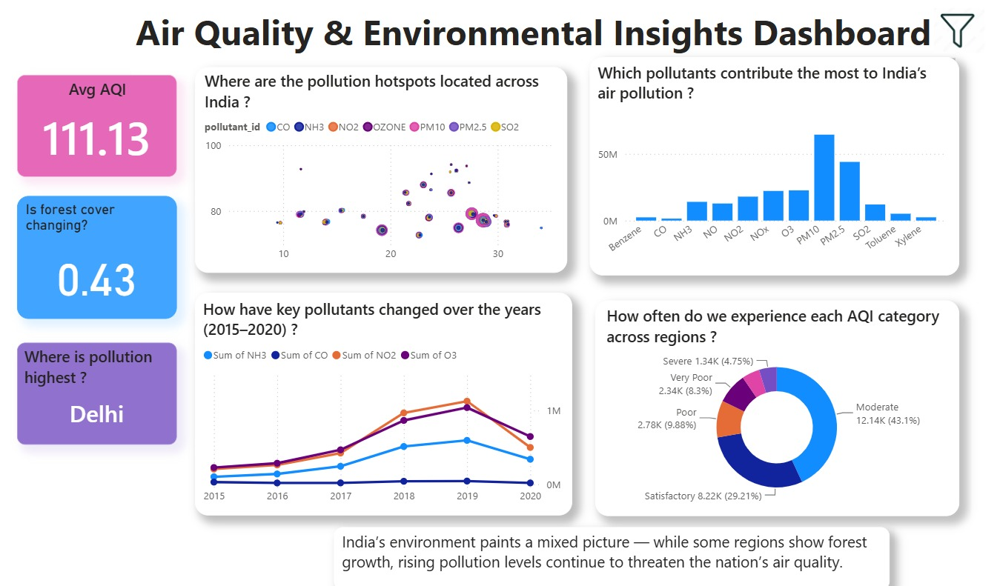
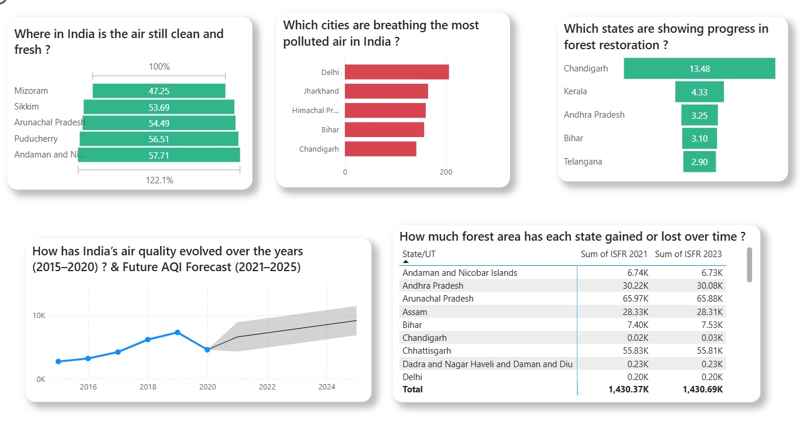
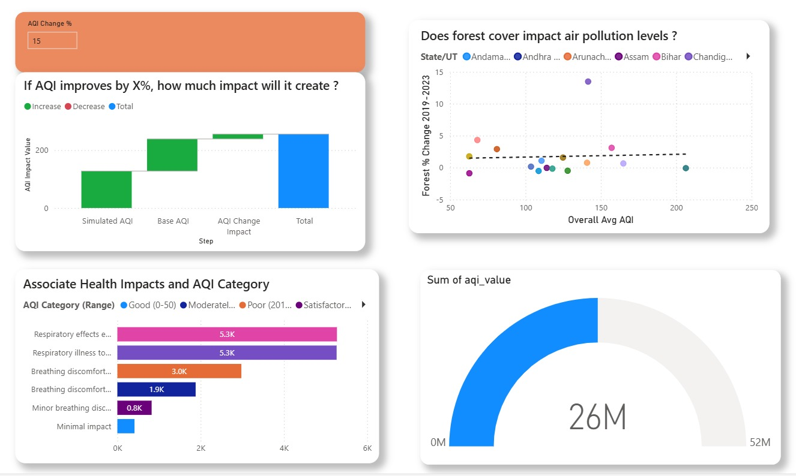

# 🌏 Air Quality & Environmental Insights — Power BI Dashboard

## 📌 Project Overview

This project analyzes **India's air quality trends (2015–2020)** by combining historical pollution data, **real-time AQI**, and **forest cover statistics** to present a holistic view of environmental health in India.

The dashboard is built using **Power BI** and focuses on transforming raw environmental datasets into **clear, actionable insights** through strong data modeling, DAX measures, and visual storytelling.

---

## 🖼️ Dashboard Preview

| | | |
|---|---|---|
|  |  |  |

---

## 🎯 Objectives

* Understand long-term air quality trends across Indian cities and states
* Identify pollution hotspots and most affected regions
* Analyze pollutant-level contributions to AQI (PM2.5, PM10, NO₂, CO, etc.)
* Compare environmental sustainability (forest cover) with pollution growth
* Provide an interactive, decision-ready dashboard

---

## 🗂️ Datasets Used

| Dataset         | Description                                               |
| --------------- | ----------------------------------------------------------|
| **cityday**     | Primary fact table with daily city-level AQI & pollutants |
| **cityhour**    | Hourly city-level pollution data                          |
| **stationday**  | Daily station-level pollution data                        |
| **stationhour** | Hourly station-level pollution data                       |
| **stations**    | Station metadata (StationId, City, State, Status)         |
| **aqi**         | State-level daily AQI aggregates                          |
| **realtime**    | Latest AQI readings for live indicators                   |
| **forestcover** | ISFR data (2019, 2021, 2023) for environmental context    |

Raw datasets are available in the [`Dataset`](Dataset) folder.

---

## 🔧 Data Cleaning & ETL

* Standardized **date and datetime formats**
* Normalized **city and state names**
* Resolved **duplicate station records**
* Filled missing values (forward-fill for hourly station streams)
* Flagged nulls for transparency
* Removed **sensor outliers** beyond plausible ranges (PM2.5 / PM10)
* Ensured pollutant **unit consistency**
* Created derived metrics such as:

  * Monitoring station count per city
  * Population-weighted indicators (where applicable)

Full data cleaning workflow is documented in [`Data_Cleaning.ipynb`](Data_Cleaning.ipynb).

---

## 🧩 Data Model (Star Schema)

**Fact Table**

* `cityday` (Date, City, Pollutants, AQI, AQI Bucket)

**Dimension Tables**

* `stations` (StationId, City, State)
* `aqi` (State-level summaries)
* `realtime` (Latest AQI values)
* `forestcover` (State/UT forest statistics)
* `Date` (Calendar table)

**Relationships**

* One-to-Many: Dimensions → Facts
* Single-direction filtering (bi-directional only when required for slicers)

Full schema diagram and modeling notes are in the [`Data Modeling`](Data%20Modeling) folder.

---

## 📐 KPIs & DAX Measures

* **Average AQI** – Overall air quality indicator for India
* **Forest Cover Change Index** – Tracks environmental sustainability trend
* **Most Polluted State** – State with highest average AQI in the dataset
* **AQI What-If Simulation** – Models the impact of an X% AQI improvement on overall environmental outcomes
* **Year-over-Year AQI % Change** – Tracks AQI growth/decline across years

All DAX formulas, with explanations, are documented in [`DAX_Measures.md`](DAX_Measures.md).

---

## 📊 Key Dashboard Insights

* Pollution hotspots are concentrated around major urban regions, with **Delhi** as the most critical AQI hotspot
* **PM10** registers the highest absolute pollutant contribution, with **PM2.5** close behind
* AQI levels peaked during **2018–2019**
* Majority of regions fall under the **Moderate AQI** category (43.1%), with a combined 22.93% falling under Poor, Very Poor, and Severe
* Forest cover trends show **mixed environmental progress** — some states show net forest loss alongside rising AQI, while others (e.g., Chandigarh) show strong restoration gains
* Health impact analysis shows respiratory illness cases concentrated in the highest AQI severity bands

---

## 🖥️ Dashboard Features

* Interactive slicers for:

  * Date
  * State
  * Pollutant
  * AQI Category
* Scatter maps for hotspot identification
* Trend charts for time-series analysis
* KPI cards for quick insights
* What-if simulation for AQI improvement impact analysis
* Forest cover vs. AQI correlation scatter plot

---

## 🚀 Deployment

The dashboard is published on **Power BI Service** for easy access and sharing.

🔗 **Dashboard Link:** [View Live Dashboard](https://app.powerbi.com/view?r=eyJrIjoiOWRjMDA5MTQtNmI1OS00Y2Y2LTgyMzQtMzRjZTczYjRiYjQ0IiwidCI6ImRhZTA4MDk3LTgyNjAtNDk5Ni05MDY2LWZhZTExYmY3MWVhNiJ9)

📁 **PBIX File:** [`airpollution.pbix`](airpollution.pbix)

---

## 🛠️ Tools & Technologies

* **Power BI** (Data Modeling, DAX, Visualization)
* **Power Query** (ETL)
* **Python / Jupyter Notebook** (Data Cleaning — see [`Data_Cleaning.ipynb`](Data_Cleaning.ipynb))
* **Excel / CSV** datasets
* **Star Schema Modeling**

---

## 📁 Repository Structure

├── Data Modeling/
│   ├── README.md
│   └── air_quality_star_schema.png
├── Dataset/
├── assets/
│   ├── Dashboard_preview1.jpeg
│   ├── Dashboard_preview2.jpeg
│   └── Dashboard_preview3.jpeg
├── DAX_Measures.md
├── Data_Cleaning.ipynb
├── README.md
└── airpollution.pbix
---

## 📌 Key Learnings

* End-to-end BI project execution, from raw data to published dashboard
* Designing scalable star-schema data models
* Writing optimized, reusable DAX measures (including what-if simulations)
* Translating data into business & environmental insights
* Building professional, portfolio-ready dashboards

---

## 📬 Contact

**Author:** Latha Sri Ravirala
🔗 LinkedIn: [lathasri-ravirala](https://www.linkedin.com/in/lathasri-ravirala-06b606309)

---

⭐ If you find this project useful, feel free to star the repository!
